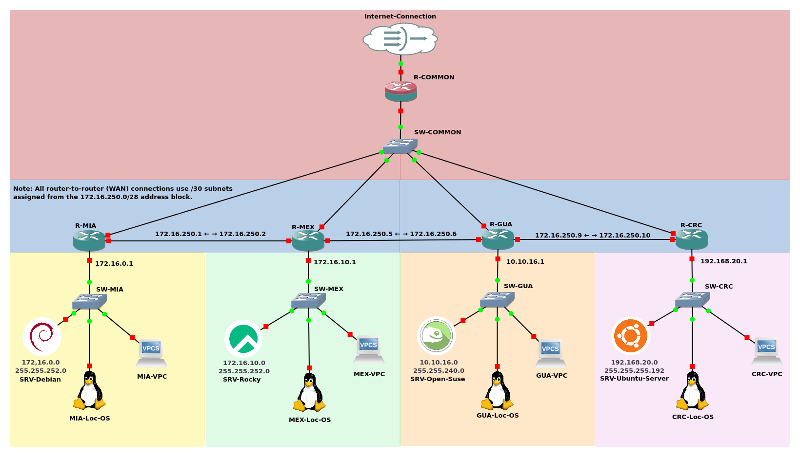

# GNS3 Networking Practice Project

This repository contains a complete practice for designing and configuring a distributed network using GNS3. It includes router configurations, installation scripts for servers, and a visual diagram of the network topology.

## 📚 Index

- [🔧 GNS3 Project Screenshot](#-gns3-project-screenshot)
- [Region Codes](#region-codes)
- [📊 General Description](#-general-description)
- [🔹 Topology](#-topology)
- [🌐 Addressing and NAT (Central Router)](#-addressing-and-nat-central-router)
- [📝 Routes and RIP](#-routes-and-rip)
- [💻 Operating Systems Used on Servers](#-operating-systems-used-on-servers)
- [📃 Included Files](#-included-files)
- [🔗 External Connection](#-external-connection)
- [📚 Requirements](#-requirements)
- [Interface and Connection Documentation](#interface-and-connection-documentation)
- [🖥️ Interface Connections Documentation](#-interface-connections-documentation)
- [⚖️ License](#-license)

---

### 🔧 GNS3 Project Screenshot

Below is the actual view of the topology inside GNS3:



---

## Region Codes

| Code    | Location                |
|---------|-------------------------|
| MIA     | Miami, USA              |
| MEX     | Mexico City             |
| GUA     | Guatemala City          |
| CRC     | San José, Costa Rica    |
| COMMON | Central Backbone Router (Core Network) |

---

## 📊 General Description

The simulated network consists of five interconnected regions:

* Common Network (main interconnection node and Internet gateway)
* Miami Network
* Mexico Network
* Guatemala Network
* Costa Rica Network

Cisco routers and virtual machines with different operating systems were used to simulate servers and workstations.

## 🔹 Topology

* **Main router:** Cisco C7200 (Central Network)
* **Edge routers:** Cisco C3725 for each region (Miami, Mexico, Guatemala, Costa Rica)
* **Protocols:** RIP v2 with static routes for Internet access
* **Internet connection:** `f1/0` interface of the Central Network router, with IP assigned by DHCP and NAT configured

## 🌐 Addressing and NAT (Central Router)

```bash
interface f0/0
 ip address 172.16.100.254 255.255.255.0
 ip nat inside
 no shutdown

interface f1/0
 ip address dhcp
 ip nat outside
 no shutdown

ip nat inside source list 1 interface f1/0 overload

access-list 1 permit 172.16.0.0 0.0.255.255
access-list 1 permit 10.10.16.0 0.0.0.255
access-list 1 permit 192.168.20.0 0.0.0.63
```

## 📝 Routes and RIP

```bash
router rip
 version 2
 network 172.16.0.0
 network 10.10.16.0
 network 192.168.20.0
 no auto-summary
```

Each regional router is connected to the central router through a `f2/0` interface configured in the `172.16.100.0/24` subnet and a point-to-point interface for internal connections.

## 💻 Operating Systems Used on Servers

* Ubuntu Server
* Debian
* openSUSE
* Rocky Linux

These servers were configured using the [installation script](scripts/install_dependencies.sh), which automates the installation of packages and services such as Apache, MariaDB, PHP, DNS, DHCP, among others.

## 📃 Included Files

| File                          | Description                                                         |
| ----------------------------- | ------------------------------------------------------------------- |
| [configure_static_network.sh](scripts/configure_static_network.sh)   | Complete configurations of the Cisco routers used                   |
| [install_dependencies.sh](scripts/install_dependencies.sh) | Automated script to configure services on Linux servers             |
| [vm_config.md](vm_config.md)                | Documentation of the VMs used (ISOs, versions, configuration)       |

## 🔗 External Connection

The Common Network router can connect to a NAT cloud or directly to a `Cloud` type interface in GNS3, obtaining its IP via DHCP and acting as the Internet gateway for the entire network.

## 📚 Requirements

* GNS3 2.2 or higher
* Cisco IOS images (C7200 and C3725)
* Operating system images in `.qcow2` and `.iso` format
* QEMU and GNS3 VM configuration (recommended)

# Interface and Connection Documentation

Below is a summary of which interface connects each router and switch, to simplify configuration and cabling in GNS3:

| Device         | Interface      | Connected To        |  Description                |
| -------------- | ------------- | -------------------- | -------------------------- |
| R-Common       | f2/0          | Cloud/NAT            | Internet Gateway           |
| R-Common       | f0/0          | SW-Common            | LAN Central                |
| R-MIA          | f0/0          | R-MEX (f0/0)         | Link to Mexico             |
| R-MIA          | f0/1          | SW-MIA               | Miami LAN                  |
| R-MIA          | f2/0          | SW-Common            | Link to Common             |
| R-MEX          | f0/0          | R-MIA (f0/0)         | Link to Miami              |
| R-MEX          | f0/1          | SW-MEX               | Mexico LAN                 |
| R-MEX          | f1/0          | R-GUA (f0/0)         | Link to Guatemala          |
| R-MEX          | f2/0          | SW-Common            | Link to Common             |
| R-GUA          | f0/0          | R-MEX (f1/0)         | Link to Mexico             |
| R-GUA          | f0/1          | SW-GUA               | Guatemala LAN              |
| R-GUA          | f1/0          | R-CRC (f0/0)         | Link to Costa Rica         |
| R-GUA          | f2/0          | SW-Common            | Link to Common             |
| R-CRC          | f0/0          | R-GUA (f1/0)         | Link to Guatemala          |
| R-CRC          | f0/1          | SW-CRC               | Costa Rica LAN             |
| R-CRC          | f2/0          | SW-Common            | Link to Common             |

- **SW-XXX**: Refers to the switch of each region (Central, MIA, MEX, GUA, CRC).
- All servers and workstations connect to their respective regional switch.
- The "Cloud" node in GNS3 represents the Internet connection.


## 🖥️ Interface Connections Documentation

Each router is connected to its local switch through interface `f0/1`, and to the Central router through interface `f2/0`. Inter-region links use interfaces `f0/0` or `f1/0` as point-to-point links. More detailed mappings will be added to `vm_config.md` and diagram annotations.

README is available in:

* English 🇺🇸 *(You are here)*
* [Español 🇪🇸](readme_es.md)


## ⚖️ License

This project is for educational and personal use. The Cisco IOS images and the operating systems used have their own licenses.

---

> For more details, see the `configuracion_routers.txt` file and the visual diagram in the `diagramas/` folder.