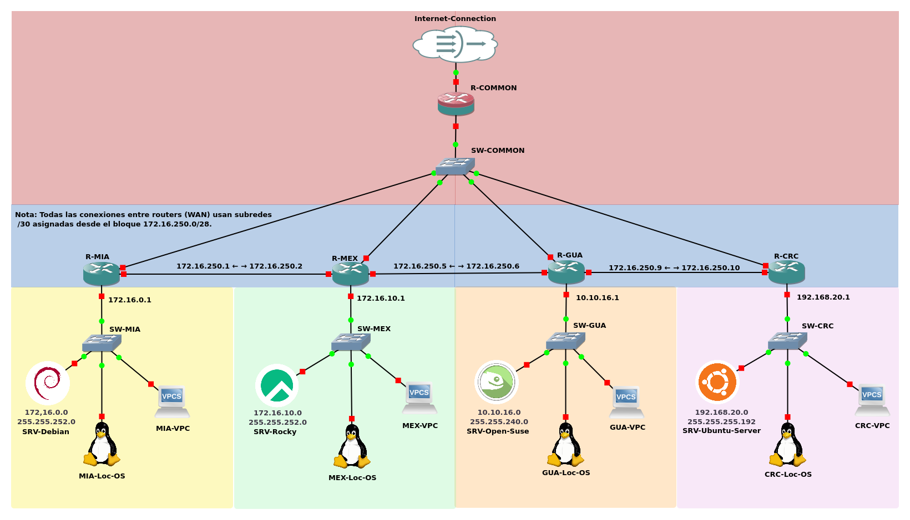

# Proyecto de Práctica de Redes en GNS3

Este repositorio contiene una práctica completa para el diseño y configuración de una red distribuida utilizando GNS3. Incluye configuraciones de routers, scripts de instalación para servidores y un diagrama visual de la topología de red.

## 📚 Índice

- [🔧 Captura de pantalla del proyecto en GNS3](#-captura-de-pantalla-del-proyecto-en-gns3)
- [Códigos de Región](#códigos-de-región)
- [📊 Descripción General](#-descripción-general)
- [🔹 Topología](#-topología)
- [🌐 Direccionamiento y NAT (Router Central)](#-direccionamiento-y-nat-router-central)
- [📝 Rutas y RIP](#-rutas-y-rip)
- [💻 Sistemas Operativos Usados en los Servidores](#-sistemas-operativos-usados-en-los-servidores)
- [📃 Archivos Incluidos](#-archivos-incluidos)
- [🔗 Conexión con el exterior](#-conexión-con-el-exterior)
- [📚 Requisitos](#-requisitos)
- [Documentación de Interfaces y Conexiones](#documentación-de-interfaces-y-conexiones)
- [🖥️ Documentación de Conexiones de Interfaces](#-documentación-de-conexiones-de-interfaces)
- [⚖️ Licencia](#-licencia)

---


### 🔧 Captura de pantalla del proyecto en GNS3

A continuación se muestra la vista real de la topología dentro de GNS3:



---

## Códigos de Región

| Código  | Ubicación                  |
|---------|----------------------------|
| MIA     | Miami, EE.UU.              |
| MEX     | Ciudad de México           |
| GUA     | Ciudad de Guatemala        |
| CRC     | San José, Costa Rica       |
| COMMON  | Router Backbone Central (Red principal) |

---

## 📊 Descripción General

La red simulada consiste en cinco regiones interconectadas:

* Red Común (nodo principal de interconexión y salida a Internet)
* Red Miami
* Red México
* Red Guatemala
* Red Costa Rica

Se utilizaron routers Cisco y máquinas virtuales con distintos sistemas operativos para simular servidores y estaciones de trabajo.

## 🔹 Topología

* **Router principal:** Cisco C7200 (Red Central)
* **Routers de borde:** Cisco C3725 para cada región (Miami, México, Guatemala, Costa Rica)
* **Protocolos:** RIP v2 con rutas estáticas para salida a Internet
* **Conexión a Internet:** Interfaz `f1/0` del router central, con IP asignada por DHCP y NAT configurado

## 🌐 Direccionamiento y NAT (Router Central)

```bash
interface f0/0
 ip address 172.16.100.254 255.255.255.0
 ip nat inside
 no shutdown

interface f1/0
 ip address dhcp
 ip nat outside
 no shutdown

ip nat inside source list 1 interface f1/0 overload

access-list 1 permit 172.16.0.0 0.0.255.255
access-list 1 permit 10.10.16.0 0.0.0.255
access-list 1 permit 192.168.20.0 0.0.0.63
```

## 📝 Rutas y RIP

```bash
router rip
 version 2
 network 172.16.0.0
 network 10.10.16.0
 network 192.168.20.0
 no auto-summary
```

Cada router regional está conectado al router central a través de la interfaz `f2/0` configurada en la subred `172.16.100.0/24` y una interfaz punto a punto para conexiones internas.

## 💻 Sistemas Operativos Usados en los Servidores

* Ubuntu Server
* Debian
* openSUSE
* Rocky Linux

Estos servidores fueron configurados usando el [script de instalación](scripts/install_dependencies.sh), que automatiza la instalación de paquetes y servicios como Apache, MariaDB, PHP, DNS, DHCP, entre otros.

## 📃 Archivos Incluidos

| Archivo                                         | Descripción                                                      |
|-------------------------------------------------|------------------------------------------------------------------|
| [configure_static_network.sh](scripts/configure_static_network.sh) | Configuraciones completas de los routers Cisco utilizados        |
| [install_dependencies.sh](scripts/install_dependencies.sh)         | Script automatizado para configurar servicios en servidores Linux |
| [vm_config_es.md](vm_config_es.md)                                   | Documentación de las VMs utilizadas (ISOs, versiones, configuración) |

## 🔗 Conexión con el exterior

El router de la Red Común puede conectarse a una nube NAT o directamente a una interfaz tipo `Cloud` en GNS3, obteniendo su IP por DHCP y actuando como puerta de enlace a Internet para toda la red.

## 📚 Requisitos

* GNS3 2.2 o superior
* Imágenes IOS de Cisco (C7200 y C3725)
* Imágenes de sistemas operativos en formato `.qcow2` y `.iso`
* QEMU y configuración de GNS3 VM (recomendado)

# Documentación de Interfaces y Conexiones

A continuación se muestra un resumen de qué interfaz conecta cada router y switch, para simplificar la configuración y el cableado en GNS3:

| Dispositivo    | Interfaz   | Conectado a         | Descripción                |
| -------------- | ---------- | ------------------- | -------------------------- |
| R-Common       | f2/0       | Cloud/NAT           | Puerta de enlace a Internet|
| R-Common       | f0/0       | SW-Common           | LAN Central                |
| R-MIA          | f0/0       | R-MEX (f0/0)        | Enlace a México            |
| R-MIA          | f0/1       | SW-MIA              | LAN Miami                  |
| R-MIA          | f2/0       | SW-Common           | Enlace a Común             |
| R-MEX          | f0/0       | R-MIA (f0/0)        | Enlace a Miami             |
| R-MEX          | f0/1       | SW-MEX              | LAN México                 |
| R-MEX          | f1/0       | R-GUA (f0/0)        | Enlace a Guatemala         |
| R-MEX          | f2/0       | SW-Common           | Enlace a Común             |
| R-GUA          | f0/0       | R-MEX (f1/0)        | Enlace a México            |
| R-GUA          | f0/1       | SW-GUA              | LAN Guatemala              |
| R-GUA          | f1/0       | R-CRC (f0/0)        | Enlace a Costa Rica        |
| R-GUA          | f2/0       | SW-Common           | Enlace a Común             |
| R-CRC          | f0/0       | R-GUA (f1/0)        | Enlace a Guatemala         |
| R-CRC          | f0/1       | SW-CRC              | LAN Costa Rica             |
| R-CRC          | f2/0       | SW-Common           | Enlace a Común             |

- **SW-XXX**: Se refiere al switch de cada región (Central, MIA, MEX, GUA, CRC).
- Todos los servidores y estaciones de trabajo se conectan a su switch regional correspondiente.
- El nodo "Cloud" en GNS3 representa la conexión a Internet.

## 🚀 Uso

### 1. Ejecutar el script install_dependencies.sh

Primero, da permisos de ejecución y ejecuta el script según tu sistema operativo.

**Para Ubuntu/Rocky/openSUSE:**
```bash
sudo chmod +x install_dependencies.sh
sudo install_dependencies.sh
```

**Para Debian:**
```bash
su -
chmod +x install_dependencies.sh
install_dependencies.sh
```

---

### 2. Ejecutar configure_static_network.sh

**Para Ubuntu/Rocky/openSUSE:**
```bash
sudo chmod +x configure_static_network.sh
sudo configure_static_network.sh
```

**Para Debian:**
```bash
su -
chmod +x configure_static_network.sh
configure_static_network.sh
```

---

### 3. Crear la base de datos y usuario para el CMS

Dependiendo del CMS que utilices, deberás editar ciertos parámetros en el script `create_user.sql` (como el nombre de la base de datos, usuario y contraseña).  
Después de realizar los cambios necesarios, puedes ejecutar el script con:

```bash
mariadb -u root -p < create_user.sql
```
Para más detalles y ejemplos, consulta directamente el archivo `create_user.sql`, que contiene información y guía adicional.

---

### 4. Configurar zonas DNS con named.conf.zones

Utiliza el archivo `named.conf.zones` para configurar tus zonas DNS.  
Este archivo define las cuatro zonas DNS usadas en este proyecto: `gt.com`, `cr.com`, `mx.com` y `us.com`.

**IMPORTANTE:**  
Si necesitas configurar una de estas zonas (por ejemplo, `gt.com`) como zona maestra en un servidor específico, **debes eliminar o comentar la zona forward correspondiente de `gt.com`** en este archivo.  
Después de eliminar la zona forward para ese dominio, sigue las instrucciones a continuación para incluir este archivo en la configuración de tu servidor. Una vez hecho esto, continúa con el manual en `readme.md` o consulta el archivo `db.example.com` para más pasos de configuración.

**Cómo usar este archivo:**

- **En Debian/Ubuntu:**
    1. Mueve este archivo a `/etc/bind/`:
       ```bash
       mv ./named.conf.zones /etc/bind/
       ```
    2. Agrega la siguiente línea a `/etc/bind/named.conf`:
       ```
       include "/etc/bind/named.conf.zones";
       ```

- **En openSUSE o Rocky Linux:**
    1. Mueve este archivo a `/etc/named/`:
       ```bash
       mv ./named.conf.zones /etc/named/
       ```
    2. Agrega la siguiente línea a `/etc/named.conf`:
       ```
       include "/etc/named/named.conf.zones";
       ```
---

#### Ejemplo: Creando un archivo de zona maestra

Puedes usar el archivo `db.example.com` como plantilla para tus archivos de zona.  
Modifica la parte "gt" para que coincida con el código de país (por ejemplo, "cr", "us", "mx") y actualiza las direcciones IP según sea necesario.  
Después de hacer los cambios, renombra el archivo para que coincida con la zona (por ejemplo, `db.gt.com`).

- **En Debian/Ubuntu:**
    - Mueve el archivo:
      ```bash
      mv ./db.gt.com /etc/bind/
      ```
    - Agrega la zona a `/etc/bind/named.conf.local`:
      ```
      zone "gt.com" {
        type master;
        file "/etc/bind/db.gt.com";
      };
      ```

- **En Rocky Linux:**
    - Mueve el archivo:
      ```bash
      mv ./db.gt.com /var/named/
      ```
    - Agrega la zona a `/etc/named.conf`:
      ```
      zone "gt.com" {
        type master;
        file "/var/named/db.gt.com";
      };
      ```

- **En openSUSE:**
    - Mueve el archivo:
      ```bash
      mv ./db.gt.com /var/lib/named/
      ```
    - Agrega la zona a `/etc/named.conf`:
      ```
      zone "gt.com" {
        type master;
        file "/var/lib/named/db.gt.com";
      };
      ```

Para más detalles, consulta los comentarios en los archivos `named.conf.zones` y `db.example.com`.

---

### 5. Generar certificados SSL y Virtual Hosts de Apache

El script [`generate_ssl_certs.sh`](./scripts/generate_ssl_certs.sh) automatiza la creación de certificados SSL autofirmados y la configuración de virtual hosts de Apache para tus subdominios. Funciona en Ubuntu, Debian, openSUSE y Rocky Linux.

#### Uso

**1. Haz el script ejecutable y ejecútalo como root:**

Para Ubuntu/Rocky/openSUSE:
```bash
sudo chmod +x ./scripts/generate_ssl_certs.sh
sudo ./scripts/generate_ssl_certs.sh
```

Para Debian:
```bash
su -
chmod +x ./scripts/generate_ssl_certs.sh
./scripts/generate_ssl_certs.sh
```

**2. Sigue los prompts interactivos:**
- Ingresa el dominio base (por ejemplo, `quetzal`).
- Selecciona el código de país (`gt`, `cr`, `us`, `mx`).
- Elige subdominios por defecto o personalizados.
- Opcionalmente, crea un usuario inicial para autenticación HTTP Basic (para `.htpasswd`).

**3. El script hará lo siguiente:**
- Generar un certificado SSL autofirmado para tu dominio.
- Crear una configuración de virtual host para cada subdominio.
- Guardar los certificados SSL en `/etc/ssl/<tu-dominio>/`.
- Guardar las configuraciones de Apache en el directorio correcto según tu sistema operativo.
- Recargar Apache para aplicar los cambios.

**4. Proteger subdominios con autenticación básica (opcional):**

Para habilitar autenticación HTTP Basic en cualquier subdominio, agrega las siguientes líneas dentro del bloque `<Directory>` de la configuración del virtual host correspondiente:

```apache
    AuthType Basic
    AuthName "Restricted Access"
    AuthUserFile /etc/apache2/.htpasswd   # o /etc/httpd/.htpasswd en Rocky
    Require valid-user
```

Consulta la salida del script para ver la ruta exacta de tu archivo `.htpasswd`.

Para más detalles, revisa los comentarios dentro del script [`generate_ssl_certs.sh`](./scripts/generate_ssl_certs.sh).

---

### 6. Configurar el servidor NTP y los clientes

#### Configuración NTP para Ubuntu Server/Debian (usando `ntpd`)

Utiliza el archivo `server.ntp.conf` ubicado en `./config_files/ntp/server.ntp.conf` para configurar tu servidor NTP.

Este archivo está diseñado para sistemas Debian/Ubuntu y configura el demonio NTP para sincronizar la hora con servidores externos.  
Puedes modificar las líneas `pool` para usar tus propios servidores NTP si lo deseas.

**Ejemplo de `./config_files/ntp/server.ntp.conf`:**
```conf
pool 0.debian.pool.ntp.org iburst
pool 1.debian.pool.ntp.org iburst
pool 2.debian.pool.ntp.org iburst
pool 3.debian.pool.ntp.org iburst
```

Después de editar (o si deseas usar la configuración por defecto), mueve el archivo a la ubicación correcta:
```bash
cd ./config_files/ntp
sudo mv server.ntp.conf /etc/ntp.conf
```

- Para aplicar los cambios, reinicia el servicio NTP:
  ```bash
  sudo systemctl restart ntp
  ```
- Para verificar el estado de sincronización:
  ```bash
  sudo ntpq -p
  sudo ntpstat
  ```

---

#### Configuración NTP para openSUSE/Rocky Linux (usando `chrony`)

Utiliza el archivo `server.client.ntp.conf` en `./config_files/ntp/server.client.ntp.conf` para configurar Chrony.

Este archivo es para sistemas openSUSE y Rocky Linux usando Chrony.  
Debe referenciar las direcciones IP o nombres de host de tus servidores NTP Debian/Ubuntu.

Después de editar, mueve el archivo a la ubicación correcta:
```bash
sudo mv server.client.ntp.conf /etc/chrony.conf
```

- Para aplicar los cambios, reinicia el servicio Chrony:
  ```bash
  sudo systemctl restart chronyd
  ```
- Para verificar el estado de sincronización:
  ```bash
  chronyc tracking
  chronyc sources -v
  ```

---

#### Configuración NTP para LocOS (o cualquier cliente Linux usando `ntpd`)

Para LocOS u otros clientes Linux usando `ntpd`, utiliza el archivo `client.ntp.conf` en `./config_files/ntp/client.ntp.conf`.

Edita el archivo para usar el servidor NTP apropiado para tu región (por ejemplo, `quetzal.ntp.gt.com`, `quetzal.ntp.cr.com`, `quetzal.ntp.mx.com`, etc.).  
Después de editar, mueve el archivo a la ubicación correcta:

```bash
cd ./config_files/ntp
sudo mv client.ntp.conf /etc/ntp.conf
```

- Reinicia el servicio NTP después de los cambios:
  ```bash
  sudo systemctl restart ntp
  ```
- Verifica el estado:
  ```bash
  sudo ntpq -p
  sudo ntpstat
  ```
---

Para más información, consulta la documentación y ejemplos en el directorio `./config_files/ntp/`.

---

## 🖥️ Documentación de Conexiones de Interfaces

Cada router está conectado a su switch local a través de la interfaz `f0/1` y al router central mediante la interfaz `f2/0`. Los enlaces entre regiones utilizan las interfaces `f0/0` o `f1/0` como enlaces punto a punto. Mapeos más detallados se agregarán en `vm_config.md` y en las anotaciones del diagrama.

El README está disponible en:

* Español 🇪🇸 *(Estás aquí)*
* [English 🇺🇸](readme.md)

## ⚖️ Licencia

Este proyecto es para uso educativo y personal. Las imágenes de Cisco IOS y los sistemas operativos utilizados tienen sus propias licencias.

---

> Para más detalles, consulta el archivo `configuracion_routers.txt` y el diagrama visual en la carpeta `diagramas/`.